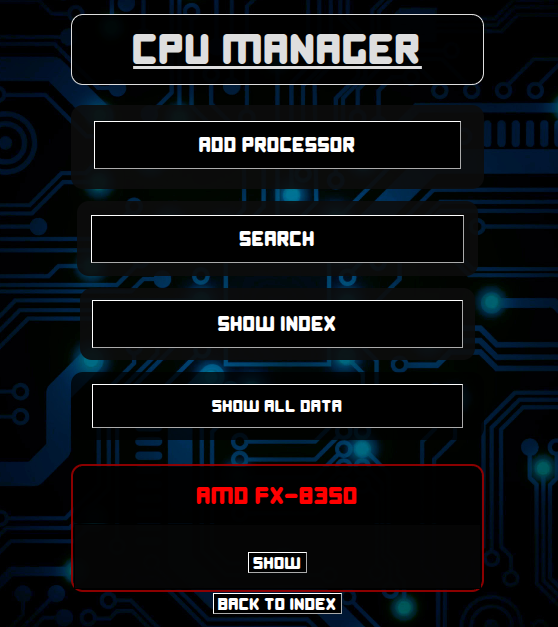

# CPUs SQL

## Table of Contents

- [About](#about)
- [ENV variables](#env-variables)
- [Setup](#setup)
- [Usage](#usage)
- [Docker](#docker)
- [CRUD Operations](#crud-operations)
- [Tests](#tests)


## About

A React frontend with an Express + Sequelize server fullstack application. Build with TypeScript.
CPUs SQL displays a list with your favorite CPUs specifications, you can add, remove and customize your own personal list of processors.

- [Live demo available on Render⇗](https://cpus-sql.onrender.com)

- Container image Available on the Docker Hub
  ```bash
  docker pull rafaeltorok/cpus-sql:latest
  ```


### Screenshots




## ENV variables

The following variables are required inside of `./server/.env`
```conf
DATABASE_URL=postgres://<username>:<password>@<hostname>:<port>/<database_name>
PORT=3001
```


## Setup

- Enter the server folder
  ```bash
  cd ./server
  ```

- Install dependencies
  ```bash
  npm install
  ```

- Enter the client folder
  ```bash
  cd ./client
  ```

- Install dependencies
  ```bash
  npm install
  ```


## Usage

### Backend

- **Production** mode (serves a static build of the frontend)

  - **Compile** the backend code into JavaScript
    ```bash
    npm run tsc
    ```
  
  - **Start** the server
    ```bash
    npm run start
    ```

  - Access the Web UI on http://localhost:3001

- **Development** mode (enables hot reloading of files)
  ```bash
  npm run dev
  ```

- HTTP requests on http://localhost:3001/api

### Frontend

- Start the frontend
  ```bash
  npm run dev
  ```

- Access the Web UI on http://localhost:5173


## Docker

### Production build

- Containerized build of the compiled backend server code.

- Serves a static build of the frontend through Express.

Navigate to the server folder
```bash
cd ./server
```

Build the Docker image
```bash
docker build -t cpus-sql .
```

Start the container
```bash
docker run --name cpus-sql -p 3001:3001 --env-file=./.env cpus-sql
```


### Development Compose orchestration

- Supports hot reloading of files for both Frontend and Backend.

- Uses Nginx as a reverse proxy.

Start the Docker Compose orchestration
```bash
docker compose -f ./docker-compose.dev.yml up --build
```

- Web UI access on http://localhost:8000

- API requests on http://localhost:8000/api

Cleanup
```bash
docker compose -f ./docker-compose.dev.yml down -v
```

#### Database access via Client UI

Access the database with the following credentials

- Username: `admin`
- Password: `admin`
- Database: `data`
- Port: `5434`
- **Disable** the SSL connection if using tools such as **pgAdmin**

#### Database access via psql

Enter the container
```bash
docker exec -it cpus-sql-dev-db bash
```

Access psql
```bash
psql -U admin -W -d data
```

- Password: `admin`


## CRUD operations

- GET
  ```bash
  curl -X GET http://localhost:3001/api/cpus
  ```

- GET by ID
  ```bash
  curl -X GET http://localhost:3001/api/cpus/<id>
  ```

- POST (All fields are required, only the **TDP** is optional)
  ```bash
  curl -X POST http://localhost:3001/api/cpus -H "Content-Type: application/json" -d '{ "manufacturer":"AMD", "model":"Ryzen 7 7800X3D", "cores":8, "threads":16, "cache":104, "baseclock":4.2, "boostclock":5.2, "architecture":"Zen 4", "mbsocket":"AM5", "tdp":120 }'
  ```

- PUT (All columns are necessary, including the ones that are not going to be updated)
  ```bash
  curl -X PUT http://localhost:3001/api/cpus/20 -H "Content-Type: application/json" -d '{ "manufacturer":"AMD", "model":"Ryzen 5 7600X", "cores":6, "threads":12, "cache":38, "baseclock":4.7, "boostclock":5.3, "architecture":"Zen 4", "mbsocket":"AM5", "tdp":105 }'
  ```

- DELETE
  ```bash
  curl -X DELETE http://localhost:3001/api/cpus/<id>'
  ```


## Tests

### Integration tests

Features:

- Implemented using the Node test runner with Supertest.

**Note: the Node test runner uses the compiled code in `/build`.**

Enter the server folder
```bash
cd ./server
```

Run the tests
```bash
npm run test
```

- This command will automatically **compile** the code before running the test suites.
